# Kubernetes Homelab Series Part 1 - Introduction and Talos Installation <!-- omit from toc -->

---

## Table of Contents <!-- omit from toc -->
<!-- TOC -->
- [References](#references)
- [1. Introduction](#1-introduction)
- [2. Prerequisites and Assumptions](#2-prerequisites-and-assumptions)
- [3. Target design and IP plan](#3-target-design-and-ip-plan)
- [4. Prep Proxmox](#4-prep-proxmox)
  - [4.1 Talos ISO download](#41-talos-iso-download)
- [5. Create the VMs in Proxmox](#5-create-the-vms-in-proxmox)
  - [5.1 Create the 6 Talos VMs](#51-create-the-6-talos-vms)
  - [5.2 Create the workstation VM](#52-create-the-workstation-vm)
- [6. On the workstation: install tooling](#6-on-the-workstation-install-tooling)
- [7 Generate the base Talos configs](#7-generate-the-base-talos-configs)
- [8 Create per-node patches (hostnames, static IPs, VIP on control planes)](#8-create-per-node-patches-hostnames-static-ips-vip-on-control-planes)
  - [8.1 Control plane patches (cp1–cp3)](#81-control-plane-patches-cp1cp3)
  - [8.2 Worker patches (w1–w3)](#82-worker-patches-w1w3)
  - [8.3 Resolver configuration](#83-resolver-configuration)
  - [8.4 Render final machine configs](#84-render-final-machine-configs)
- [9. Apply configs to the nodes](#9-apply-configs-to-the-nodes)
  - [9.1 Set talosctl to talk to cp1 first (recommended)](#91-set-talosctl-to-talk-to-cp1-first-recommended)
  - [9.2 Apply the control plane configs](#92-apply-the-control-plane-configs)
  - [9.3 Apply the worker configs](#93-apply-the-worker-configs)
  - [9.4 Reapply configs](#94-reapply-configs)
- [10. Bootstrap etcd (this is the “go live” moment)](#10-bootstrap-etcd-this-is-the-go-live-moment)
- [11. Confirm the VIP is working](#11-confirm-the-vip-is-working)
- [12. Pull kubeconfig and start using the cluster](#12-pull-kubeconfig-and-start-using-the-cluster)
- [13. Operational tidy-up (recommended)](#13-operational-tidy-up-recommended)
- [14. Summary](#14-summary)
<!-- /TOC -->

---

## References

- [Siderolabs.com - Talos on Proxmox](https://docs.siderolabs.com/talos/v1.11/platform-specific-installations/virtualized-platforms/proxmox)
- Kubernetes Homelab Series
  - [Part 1 - Introduction and Talos Installation](https://blog.dalydays.com/post/kubernetes-homelab-series-part-1-talos-linux-proxmox/)
  - [Part 2 - Secrets With SOPS and age](https://blog.dalydays.com/post/kubernetes-homelab-series-part-2-sops-and-age/)
  - [Part 3 - LoadBalancer With MetalLB](https://blog.dalydays.com/post/kubernetes-homelab-series-part-3-loadbalancer-with-metallb/)
  - [Part 4 - Certificates With cert-manager and Let's Encrypt](https://blog.dalydays.com/post/kubernetes-homelab-series-part-4-certificates-with-cert-manager-and-lets-encrypt/)
  - [Part 4.5 - Debug Pod](https://blog.dalydays.com/post/kubernetes-homelab-series-part-4.5-debug-pod/)
  - [Part 5 - Ingress Controllers With Traefik](https://blog.dalydays.com/post/kubernetes-homelab-series-part-5-ingress-controllers-with-traefik/)
  - [Part 6 - Storage With democratic-csi](https://blog.dalydays.com/post/kubernetes-homelab-series-part-6-storage-with-democratic-csi/)
  - [Part 7 - Backups With Velero](https://blog.dalydays.com/post/kubernetes-homelab-series-part-7-backups-with-velero/)
  - [Kubernetes - External Services And Ingress](https://blog.dalydays.com/post/kubernetes-ingress-to-external-service/)
  - [Upgrade Talos Linux and Kubernetes](https://blog.dalydays.com/post/kubernetes-talos-upgrades/)
  - - [Kubernetes Storage - OpenEBS Replicated Storage Mayastor](https://blog.dalydays.com/post/kubernetes-storage-with-openebs/)
- [Talos Factory - iso generator](https://factory.talos.dev/)

---

## 1. Introduction

This series documents the build-out of an advanced Kubernetes homelab with production discipline, using Talos Linux on Proxmox as the foundation.

The objective is not to provide a minimal or fastest-possible Kubernetes install. Instead, the goal is to build a platform that can be operated safely over time. That means predictable upgrades, clear ownership of credentials, deliberate networking and IP planning, and an assumption that mistakes will eventually happen and must be recoverable.

Kubernetes itself is relatively easy to stand up. Operating it responsibly is harder. Storage, networking, security, and lifecycle management introduce real complexity, even in a homelab. This series addresses those realities directly rather than optimising for initial convenience.

Talos Linux is used throughout because it enforces discipline by design. Its immutable, API-driven model reduces configuration drift and makes upgrades and recovery far safer, at the cost of requiring clearer intent and stronger workflows upfront. That trade-off is deliberate and aligns well with long-lived cluster operation.

Although Proxmox is used here, the patterns described apply equally to other hypervisors such as ESXi. The emphasis is on platform design, not hypervisor-specific mechanics.

---

## 2. Prerequisites and Assumptions

This guide assumes:

- You have a homelab or lab environment capable of running virtual machines.
- You are comfortable creating VMs and managing basic networking in Proxmox or an equivalent hypervisor.
- You have at least one disk per worker node available for workloads or future storage experimentation.
- You are prepared to treat this cluster as a long-lived system rather than a disposable test environment.

<div style="
  border-left: 4px solid #6f42c1;
  background: rgba(111, 66, 193, 0.12);
  padding: 0.75em 1em;
  border-radius: 10px;
  margin: 1em 0;
">
  <strong>📝 Note</strong><br>
  A key design assumption throughout this series is the presence of a dedicated workstation VM.

This VM acts as the long-lived administrative endpoint for the platform. It is where Talos secrets are generated and stored, machine configurations are rendered, and kubeconfig files live. This VM should be secured, backed up, and treated as part of the platform itself rather than as a temporary helper.

This assumption carries through the rest of the series, including secrets management in Part 2.
</div>

---

## 3. Target design and IP plan

This build uses a simple, explicit network layout with static addressing. Being deliberate here avoids a large class of subtle failures later.

Example network:

Network: 192.168.88.0/24
Gateway: 192.168.88.1
DNS: 192.168.88.1 (or your preferred resolver)
VIP (Kubernetes API): 192.168.88.50 (must be unused and not handed out by DHCP) [Sodrero Document](https://docs.siderolabs.com/talos/v1.9/networking/vip)

Nodes (static):

- talos-kube-cp1 192.168.88.51
- talos-kube-cp2 192.168.88.52
- talos-kube-cp3 192.168.88.53
- talos-kube-w1 192.168.88.54
- talos-kube-w2 192.168.88.55
- talos-kube-w3 192.168.88.56
- talos-kube-ws1 (workstation VM) 192.168.88.57

Cluster name (example): talos-kube

<div style="
  border-left: 4px solid #6f42c1;
  background: rgba(111, 66, 193, 0.12);
  padding: 0.75em 1em;
  border-radius: 10px;
  margin: 1em 0;
">
  <strong>📝 Note</strong><br>
All static IPs should be excluded from your DHCP scope. Overlapping DHCP leases are a common source of early cluster instability and can be difficult to diagnose once the cluster is live.
</div>

Two important notes about the Talos virtual IP:

1. The VIP only becomes active after etcd is bootstrapped. This is expected behaviour. [Sodrero Document](https://docs.siderolabs.com/talos/v1.9/networking/vip)
2. The VIP should not be relied on for Talos management. Always use real node IPs for talosctl endpoints. [Sodrero Document](https://docs.siderolabs.com/talos/v1.9/networking/vip)

---

## 4. Prep Proxmox

Before creating any VMs:

1. Confirm your Proxmox bridge is attached to the target network. (commonly vmbr0) is on 192.168.88.0/24.
2. Decide VM sizing based on expected workloads rather than minimums. (baseline suggestion):
    - Control planes: 2 vCPU, 4–8 GB RAM, 40+ GB disk
    - Workers: 2–4 vCPU, 8–16 GB RAM, 60+ GB disk (more if you’ll do storage workloads)
3. Download a Talos ISO from the Talos Image Factory and upload it to Proxmox local storage (Content → ISO Images → Upload). The Proxmox Talos guide recommends using Image Factory and optionally adding the QEMU guest agent extension. [Sidero Documentation](https://docs.siderolabs.com/talos/v1.10/platform-specific-installations/virtualized-platforms/proxmox)
    - If you tick siderolabs/qemu-guest-agent in Image Factory, you’ll get a custom ISO and (separately) you’ll also note the matching factory.talos.dev/installer/... string you must use later as your install image. [Sidero Documentation](https://docs.siderolabs.com/talos/v1.10/platform-specific-installations/virtualized-platforms/proxmox)

### 4.1 Talos ISO download

Visit  [Talos Factory - iso generator](https://factory.talos.dev/) and create your iso.  

**Step 1**
<a href="./images/talos001.png">
  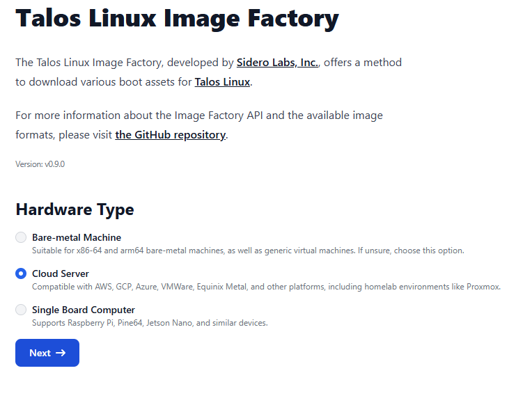
</a>
**Step 2**
<a href="./images/talos002.png">
  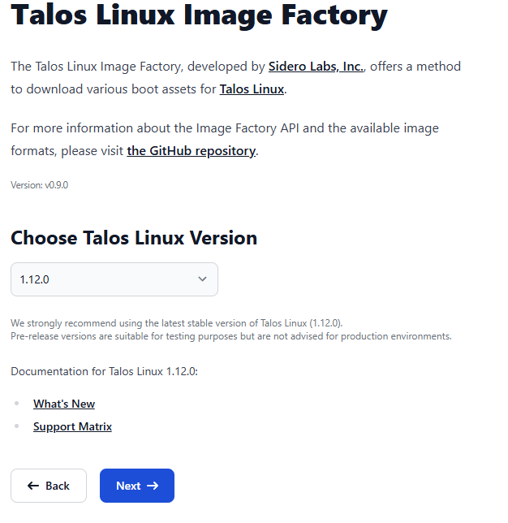
</a>
**Step 3**
<a href="./images/talos003.png">
  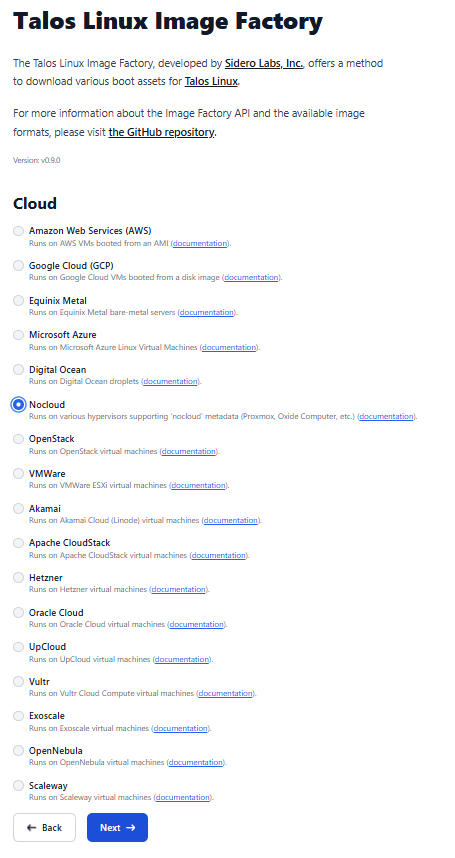
</a>
**Step 4**
<a href="./images/talos004.png">
  
</a>
**Step 5**
<a href="./images/talos005.png">
  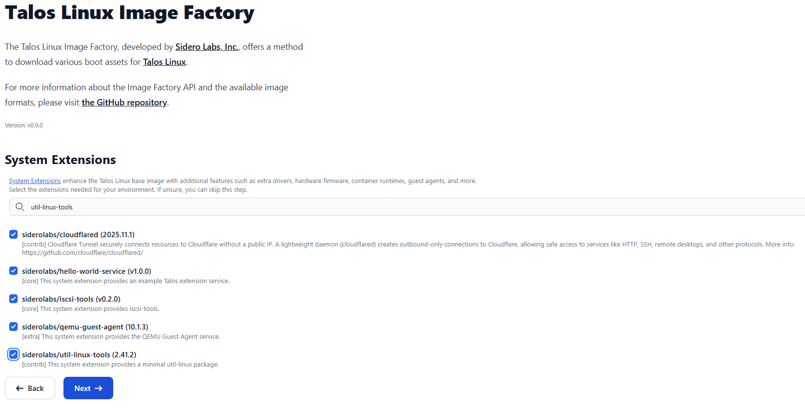
</a>
**Step 6**
<a href="./images/talos006.png">
  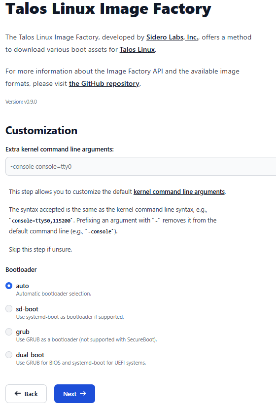
</a>
**Step 7**
<a href="./images/talos007.png">
  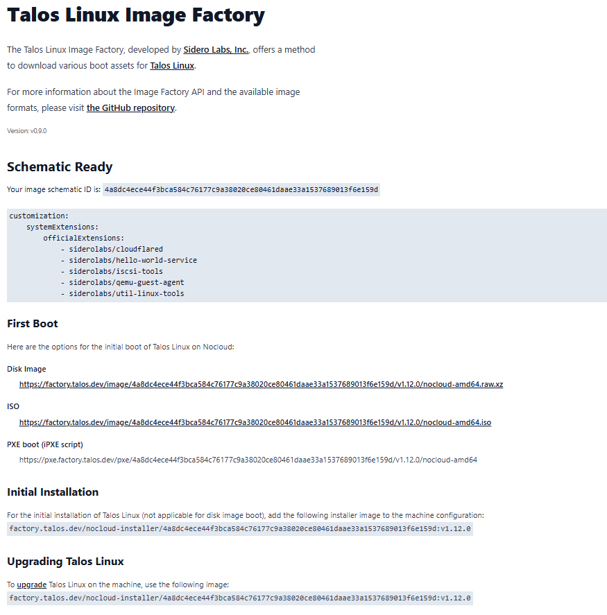
</a>

First Boot: [ISO](https://factory.talos.dev/image/4a8dc4ece44f3bca584c76177c9a38020ce80461daae33a1537689013f6e159d/v1.12.0/nocloud-amd64.iso)

Initial Installation: [Initial Installation](factory.talos.dev/nocloud-installer/4a8dc4ece44f3bca584c76177c9a38020ce80461daae33a1537689013f6e159d:v1.12.0)

Upgrading Talos Linux: [Upgrading Talos Linux](factory.talos.dev/nocloud-installer/4a8dc4ece44f3bca584c76177c9a38020ce80461daae33a1537689013f6e159d:v1.12.0)

---

## 5. Create the VMs in Proxmox

### 5.1 Create the 6 Talos VMs

Create 6 VMs with these names:

- **`talos-kube-cp1`**, **`talos-kube-cp2`**, **`talos-kube-cp3`**
- **`talos-kube-w1`**, **`talos-kube-w2`**, **`talos-kube-w3`**

Proxmox VM settings (good defaults):

- OS: boot from the Talos ISO you uploaded
- System: UEFI or BIOS is fine; keep defaults unless you standardise on UEFI
- Disk: VirtIO SCSI (recommended), single disk per VM is easiest
- Network: VirtIO NIC attached to `vmbr0`
- Start each VM and confirm it boots into Talos (you’ll see the Talos dashboard on the console)

<table>
  <tr>
    <td align="center">
      <strong>Step 1</strong><br>
      <a href="./images/proxmox001.png">
        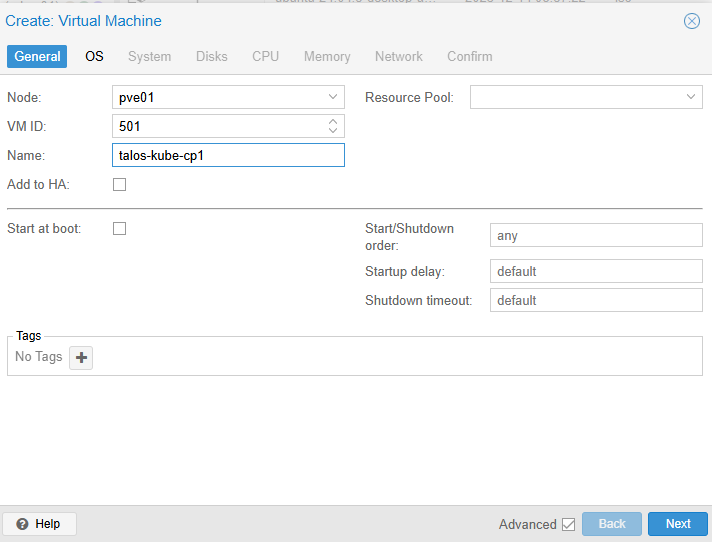
      </a>
    </td>
    <td align="center">
      <strong>Step 2</strong><br>
      <a href="./images/proxmox002.png">
        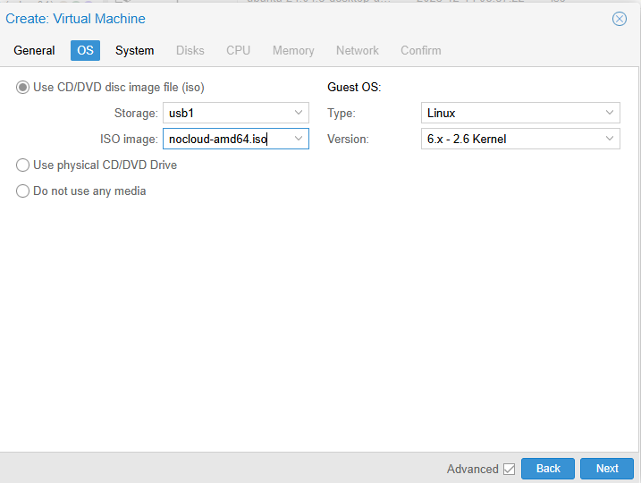
      </a>
    </td>
  </tr>
</table>

<table>
  <tr>
    <td align="center">
      <strong>Step 3</strong><br>
      <a href="./images/proxmox003.png">
        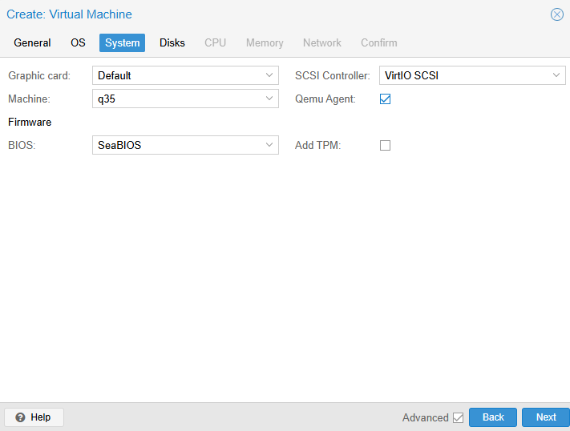
      </a>
    </td>
    <td align="center">
      <strong>Step 4</strong><br>
      <a href="./images/proxmox004.png">
        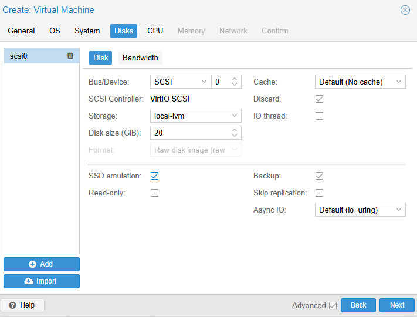
      </a>
    </td>
  </tr>
</table>


<table>
  <tr>
    <td align="center">
      <strong>Step 5</strong><br>
      <a href="./images/proxmox005.png">
        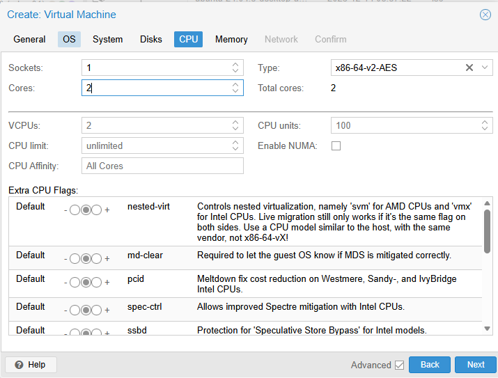
      </a>
    </td>
    <td align="center">
      <strong>Step 6</strong><br>
      <a href="./images/proxmox006.png">
        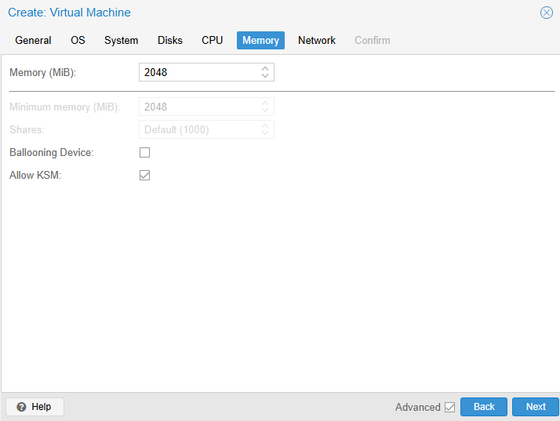
      </a>
    </td>
  </tr>
</table>


<table>
  <tr>
    <td align="center">
      <strong>Step 7</strong><br>
      <a href="./images/proxmox007.png">
        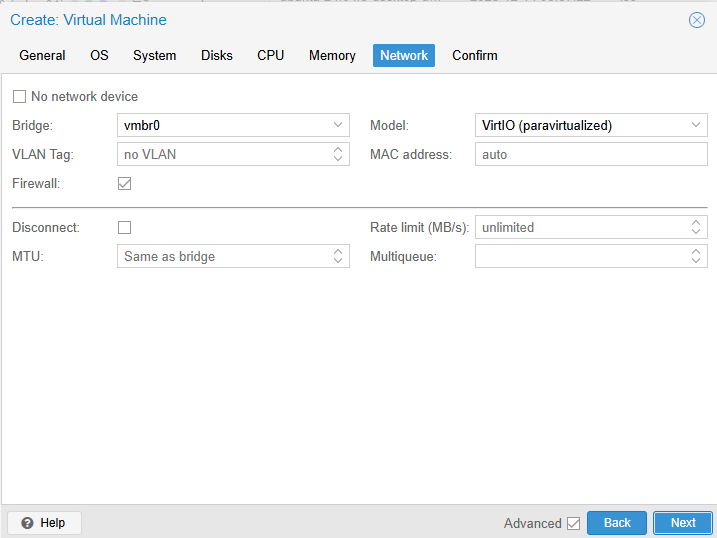
      </a>
    </td>
  </tr>
</table>


<div style="
  border-left: 4px solid #6f42c1;
  background: rgba(111, 66, 193, 0.12);
  padding: 0.75em 1em;
  border-radius: 10px;
  margin: 1em 0;
">
  <strong>📝 Note</strong><br>
  If you want to harden this further without adding much complexity:

- Enable QEMU guest agent in Proxmox and include it via Image Factory, as you already hinted. This materially improves observability and clean shutdowns.

- Disable memory ballooning on Talos VMs. Talos is happier with fixed memory.

- Pin CPU type to host where possible to avoid live-migration quirks.

None of these are required, but they align better with Talos’ immutable design philosophy.
</div>

### 5.2 Create the workstation VM

Create `talos-kube-ws1`1 using Ubuntu/Debian (or whatever you prefer), set it to `192.168.88.57`, and install admin tooling there.

This VM acts as the human control plane. All administrative tooling, Talos secrets, rendered configs, and kubeconfig files live here. Back it up and avoid treating it as ephemeral.

---

## 6. On the workstation: install tooling

On `talos-kube-ws1`:

1. Install `talosctl` (official Proxmox guide shows Homebrew for macOS, but on Linux you can use the Talos install script or your package method). [Sidero Documentation](https://docs.siderolabs.com/talos/v1.10/platform-specific-installations/virtualized-platforms/proxmox)

    ```bash
    curl -sL https://talos.dev/install | sh
    ```

2. Install `kubectl`  [Versions](https://kubernetes.io/releases/) (and optionally `helm`).

    **LXC**

    ```bash
    # 0) Remove the broken repo file (and any wrong keyring if you created one)
    sudo rm -f /etc/apt/sources.list.d/kubernetes.list
    sudo rm -f /etc/apt/keyrings/kubernetes-archive-keyring.gpg

    # 1) Prereqs (note: gpg matters here)
    sudo apt-get update
    sudo apt-get install -y apt-transport-https ca-certificates curl gpg

    # 2) Ensure keyrings dir exists
    sudo mkdir -p -m 755 /etc/apt/keyrings

    # 3) Add the Kubernetes repo signing key (correct URL)
    curl -fsSL https://pkgs.k8s.io/core:/stable:/v1.35/deb/Release.key \
      | sudo gpg --dearmor -o /etc/apt/keyrings/kubernetes-apt-keyring.gpg

    # 4) Add the Kubernetes apt repo (correct format, note the trailing "/ /")
    echo 'deb [signed-by=/etc/apt/keyrings/kubernetes-apt-keyring.gpg] https://pkgs.k8s.io/core:/stable:/v1.35/deb/ /' \
      | sudo tee /etc/apt/sources.list.d/kubernetes.list

    # 5) Install kubectl
    sudo apt-get update
    sudo apt-get install -y kubectl

    # Optional: stop kubectl being upgraded automatically
    sudo apt-mark hold kubectl
    ```

    **OR**

    ```bash
    # Update package list and install necessary dependencies:
    sudo apt update
    sudo apt install -y apt-transport-https ca-certificates curl

    # Download the Google Cloud public signing key:
    # For all ubuntu/debian versions
    curl -fsSL pkgs.k8s.io | sudo gpg --dearmor -o /etc/apt/keyrings/kubernetes-archive-keyring.gpg

    # Add the Kubernetes apt repository
    echo "deb [signed-by=/etc/apt/keyrings/kubernetes-archive-keyring.gpg] pkgs.k8s.io release main" | sudo tee /etc/apt/sources.list.d/kubernetes.list

    # Update apt and install kubectl
    sudo apt update
    sudo apt install -y kubectl
    ```

<div style="
  border-left: 4px solid #6f42c1;
  background: rgba(111, 66, 193, 0.12);
  padding: 0.75em 1em;
  border-radius: 10px;
  margin: 1em 0;
">
  <strong>📝 Note</strong><br>
  The Kubernetes apt repository (pkgs.k8s.io) and its signing key layout change from time to time. The commands above are correct at the time of writing, however kubectl installation is a common failure point in older documentation.
  
  If apt update or kubectl installation fails, validate the current repository and keyring instructions against the official Kubernetes documentation before troubleshooting further. This is expected drift rather than an environment issue.
</div>

You’ll use `talosctl` for everything Talos and for grabbing kubeconfig later.

---

## 7 Generate the base Talos configs

Generate cluster secrets and base machine configs using `talosctl gen secrets` and `talosctl gen config`.

Store `secrets.yaml` securely. Treat it as equivalent to cluster root credentials.

On the workstation, set:

- `CONTROL_PLANE_VIP=192.168.88.50`
- `CLUSTER_NAME=talos-kube`
- `INSTALL_IMAGE=<your factory.talos.dev/installer/...:vX.Y.Z>`

That install image string is the one associated with your Image Factory build (the DalyDays post calls this out explicitly). [Daly Days Blog+1](https://blog.dalydays.com/post/kubernetes-homelab-series-part-1-talos-linux-proxmox/)

**RUN:**

```bash
mkdir -p talos-kube/_out
cd talos-kube

# CLUSTER_NAME should be the name of the cluster
export CLUSTER_NAME=talos-kube
# CONTROL_PLANE_IP should be the VIP you plan on using (not the DHCP assigned), or the IP of one of your control plane nodes if not using a VIP
export CONTROL_PLANE_VIP=192.168.88.50
# FACTORY_IMAGE should be updated to the image you want to install
export INSTALL_IMAGE="factory.talos.dev/nocloud-installer/88d1f7a5c4f1d3aba7df787c448c1d3d008ed29cfb34af53fa0df4336a56040b:v1.12.0"  # replace with yours

# Generate new Talos secrets Secrets are used to authenticate with the Talos cluster.
talosctl gen secrets

# Generate new Talos configs. Configs are used to configure the Talos cluster.
talosctl gen config "${CLUSTER_NAME}" "https://${CONTROL_PLANE_VIP}:6443" \
  --with-secrets secrets.yaml \
  --output-dir _out \
  --install-image "${INSTALL_IMAGE}"
```

This produces:

- `secrets.yaml`
- `_out/controlplane.yaml`
- `_out/worker.yaml`
- `_out/talosconfig`

(Keep secrets.yaml safe. Treat it like keys to the kingdom.)

---

## 8 Create per-node patches (hostnames, static IPs, VIP on control planes)

Use Talos patches for hostnames, static networking, and VIP configuration. Patch‑driven workflows are strongly recommended for repeatability and version control. [Sidero Documentation+1](https://docs.siderolabs.com/talos/v1.9/configure-your-talos-cluster/system-configuration/patching?utm_source=chatgpt.com)

Create a patches/ folder:

```bash
mkdir -p patches rendered
```

### 8.1 Control plane patches (cp1–cp3)

Create patches/cp1.yaml:

```bash
nano ~/talos-kube/patches/cp1.yaml
```

```yml
# patches/cp1.yaml
machine:
  network:
    interfaces:
      - interface: eth0
        dhcp: false
        addresses:
          - 192.168.88.51/24
        routes:
          - network: 0.0.0.0/0
            gateway: 192.168.88.1
        vip:
          ip: 192.168.88.50
---
apiVersion: v1alpha1
kind: HostnameConfig
auto: off
hostname: talos-kube-cp1

```

Create patches/cp2.yaml and patches/cp3.yaml with .52 and .53 respectively, same VIP.

This VIP stanza is exactly the Talos VIP mechanism for control planes. [Sidero Documentation](https://docs.siderolabs.com/talos/v1.9/networking/vip)

### 8.2 Worker patches (w1–w3)

Create patches/w1.yaml:

```bash
nano ~/talos-kube/patches/w1.yaml
```

```yml
machine:
  network:
    interfaces:
      - interface: eth0
        dhcp: false
        addresses:
          - 192.168.88.54/24
        routes:
          - network: 0.0.0.0/0
            gateway: 192.168.88.1
---
apiVersion: v1alpha1
kind: HostnameConfig
auto: off
hostname: talos-kube-w1
```

Create patches/w2.yaml and patches/w3.yaml with .55 and .56.

### 8.3 Resolver configuration

The resolver configuration is environment‑specific. Adjust nameservers and search domains deliberately. Incorrect search domains can cause subtle DNS issues across the cluster.


- The `nameservers` field is a list of DNS server IP addresses that Talos will use for DNS resolution.
- The `searchDomains` field allows you to specify search domains that will be appended to unqualified domain names during DNS resolution, the default search domains is to use the domain part of the machine’s hostname. 
- The `disableDefault` field, when set to true, prevents Talos from using the default search domains derived from the machine’s hostname.

```bash
nano ~/talos-kube/patches/resolvers.yaml
```

```yml
# patches/resolvers.yaml
apiVersion: v1alpha1
kind: ResolverConfig
nameservers:
  - address: 192.168.88.1
searchDomains: # optional
    domains:
        - fouchger.uk
    disableDefault: false
```

### 8.4 Render final machine configs

In this guide, “rendered” refers to fully assembled but plaintext Talos configuration files. These are suitable for initial bootstrap but should not be committed to source control without encryption, which is addressed in Part 2.

Render each final config file:

```bash
# Control planes
talosctl machineconfig patch _out/controlplane.yaml \
  --patch @patches/resolvers.yaml \
  --patch @patches/cp1.yaml \
  -o rendered/talos-kube-cp1.yaml

talosctl machineconfig patch _out/controlplane.yaml \
  --patch @patches/resolvers.yaml \
  --patch @patches/cp2.yaml \
  -o rendered/talos-kube-cp2.yaml

talosctl machineconfig patch _out/controlplane.yaml \
  --patch @patches/resolvers.yaml \
  --patch @patches/cp3.yaml \
  -o rendered/talos-kube-cp3.yaml


# Workers
talosctl machineconfig patch _out/worker.yaml \
  --patch @patches/resolvers.yaml \
  --patch @patches/w1.yaml \
  -o rendered/talos-kube-w1.yaml

talosctl machineconfig patch _out/worker.yaml \
  --patch @patches/resolvers.yaml \
  --patch @patches/w2.yaml \
  -o rendered/talos-kube-w2.yaml

talosctl machineconfig patch _out/worker.yaml \
  --patch @patches/resolvers.yaml \
  --patch @patches/w3.yaml \
  -o rendered/talos-kube-w3.yaml

```

---

## 9. Apply configs to the nodes

At this point your Talos VMs are booted from ISO. Initially they may have DHCP addresses shown on the Proxmox console. You can apply configs using those “temporary” IPs, then once the static config is applied, they’ll come up on the static IPs.

### 9.1 Set talosctl to talk to cp1 first (recommended)

Suggested mapping (example only):

cp1 → 192.168.88.101
cp2 → 192.168.88.102
cp3 → 192.168.88.103

Because VIP won’t exist until after bootstrap, before applying anything, set your local talosctl context. This does not talk to the node yet, it just configures your workstation.. [Sidero Documentation+1](https://docs.siderolabs.com/talos/v1.9/networking/vip) Using cp1’s final static IP here is deliberate and future-proof.

```bash
export TALOSCONFIG="$(pwd)/_out/talosconfig"
talosctl --talosconfig "$TALOSCONFIG" config endpoints 192.168.88.51
talosctl --talosconfig "$TALOSCONFIG" config nodes 192.168.88.51
```

### 9.2 Apply the control plane configs

Apply each control plane's rendered config to the node’s current DHCP address. If the node is fresh and you’re using the console shown IP before it’s trusted, use `--insecure` for initial apply.

<div style="
  border-left: 4px solid #6f42c1;
  background: rgba(111, 66, 193, 0.12);
  padding: 0.75em 1em;
  border-radius: 10px;
  margin: 1em 0;
">
  <strong>📝 Note</strong><br>
Use `--insecure` only for the first apply on fresh nodes.
</div>

Example (adjust `-n` to whatever IP the node currently has at the moment of apply):

```bash
talosctl apply-config -n <cp1-current-ip> --insecure --file rendered/talos-kube-cp1.yaml
talosctl apply-config -n <cp2-current-ip> --insecure --file rendered/talos-kube-cp2.yaml
talosctl apply-config -n <cp3-current-ip> --insecure --file rendered/talos-kube-cp3.yaml
```

After apply, the nodes will reboot or reconfigure networking as needed and should come up on:

- `192.168.88.51`, `.52`, `.53`

### 9.3 Apply the worker configs

Same pattern:

```bash
talosctl apply-config -n <w1-current-ip> --insecure --file rendered/talos-kube-w1.yaml
talosctl apply-config -n <w2-current-ip> --insecure --file rendered/talos-kube-w2.yaml
talosctl apply-config -n <w3-current-ip> --insecure --file rendered/talos-kube-w3.yaml
```

They should come up on:

192.168.88.54, .55, .56

### 9.4 Reapply configs

```bash
export TALOSCONFIG="$(pwd)/_out/talosconfig"
talosctl --talosconfig "$TALOSCONFIG" config endpoints 192.168.88.51
talosctl --talosconfig "$TALOSCONFIG" config nodes 192.168.88.51

talosctl apply-config -n 192.168.88.51 --file rendered/talos-kube-cp1.yaml
talosctl apply-config -n 192.168.88.52 --file rendered/talos-kube-cp2.yaml
talosctl apply-config -n 192.168.88.53 --file rendered/talos-kube-cp3.yaml
talosctl apply-config -n 192.168.88.54 --file rendered/talos-kube-w1.yaml
talosctl apply-config -n 192.168.88.55 --file rendered/talos-kube-w2.yaml
talosctl apply-config -n 192.168.88.56 --file rendered/talos-kube-w3.yaml
```

---

## 10. Bootstrap etcd (this is the “go live” moment)

Bootstrap etcd from a single control plane node. This is the point at which the cluster becomes live and the VIP election process begins.

Pick one control plane (usually cp1) to bootstrap:

```bash
talosctl --talosconfig "$TALOSCONFIG" bootstrap -n 192.168.88.51
```

This is what causes etcd to initialise and, shortly after, enables the VIP leader election behaviour. [Sidero Documentation](https://docs.siderolabs.com/talos/v1.9/networking/vip)

Check control plane health:

```bash
talosctl --talosconfig "$TALOSCONFIG" health -n 192.168.88.51
```

---

## 11. Confirm the VIP is working

Validate that the Kubernetes API is reachable via the VIP once the control plane is healthy.

Once Kubernetes is up, one control plane should “own” `192.168.88.50` on layer 2.

From the workstation, check ARP/neighbour table, or simply try:

```bash
curl -k https://192.168.88.50:6443/version
```

expected output

```yml
{
  "kind": "Status",
  "apiVersion": "v1",
  "metadata": {},
  "status": "Failure",
  "message": "Unauthorized",
  "reason": "Unauthorized",
  "code": 401
}
```

You should get a Kubernetes version JSON response. If not, give it a bit more time right after bootstrap, as VIP won’t come up until the control plane and etcd are in a good state. [Sidero Documentation](https://docs.siderolabs.com/talos/v1.9/networking/vip)

---

## 12. Pull kubeconfig and start using the cluster

Retrieve kubeconfig from Talos and point `kubectl` at the VIP endpoint. (Talos merges into your default kubeconfig unless you tell it otherwise). [Sidero Documentation](https://docs.siderolabs.com/talos/v1.9/learn-more/talosctl?utm_source=chatgpt.com)

Validate node readiness before proceeding with additional components.

You should see 6 nodes (3 control planes, 3 workers).

1. Point talosctl at the control plane
    Talos needs to know which endpoint to talk to. Use one control plane node IP, not the VIP, for Talos management.

    From the workstation shell:

    ```bash
    export TALOSCONFIG=$(pwd)/_out/talosconfig
    talosctl config endpoints 192.168.88.51
    talosctl config nodes 192.168.88.51
    ```

    This establishes a stable management path and avoids early VIP edge cases.

2. Pull the kubeconfig from the cluster

    Now ask Talos to generate a Kubernetes kubeconfig that targets the VIP.

    ```bash
    talosctl kubeconfig ./kubeconfig \
      --force \
      -n 192.168.88.50
    ```

    What this does in plain terms is retrieve signed client credentials from the control plane and write a standard kubeconfig file that kubectl understands.

3. Point kubectl at the kubeconfig

    You now need to tell kubectl which config to use.

    ```bash
    export KUBECONFIG=$(pwd)/kubeconfig
    ```

    At this point, kubectl and the API server have mutual trust.

4. Validate access

    Run the following checks in order:

    ```bash
    kubectl version
    kubectl get nodes -o wide
    ```

output:

```yml
Client Version: v1.35.0
Kustomize Version: v5.7.1
Server Version: v1.35.0
NAME             STATUS   ROLES           AGE   VERSION   INTERNAL-IP     EXTERNAL-IP   OS-IMAGE          KERNEL-VERSION   CONTAINER-RUNTIME
talos-kube-cp1   Ready    control-plane   95m   v1.35.0   192.168.88.51   <none>        Talos (v1.12.0)   6.18.1-talos     containerd://2.1.6
talos-kube-cp2   Ready    control-plane   95m   v1.35.0   192.168.88.52   <none>        Talos (v1.12.0)   6.18.1-talos     containerd://2.1.6
talos-kube-cp3   Ready    control-plane   95m   v1.35.0   192.168.88.53   <none>        Talos (v1.12.0)   6.18.1-talos     containerd://2.1.6
talos-kube-w1    Ready    <none>          83m   v1.35.0   192.168.88.54   <none>        Talos (v1.12.0)   6.18.1-talos     containerd://2.1.6
talos-kube-w2    Ready    <none>          83m   v1.35.0   192.168.88.55   <none>        Talos (v1.12.0)   6.18.1-talos     containerd://2.1.6
talos-kube-w3    Ready    <none>          83m   v1.35.0   192.168.88.56   <none>        Talos (v1.12.0)   6.18.1-talos     containerd://2.1.6
```

You should see all control plane nodes, and workers if they have already joined. The API endpoint shown should be https://192.168.88.50:6443 .

---

## 13. Operational tidy-up (recommended)

1. Add all node IPs to your Talos endpoints configuration. (use real node IPs, not the VIP):

    ```bash
    export TALOSCONFIG="$PWD/_out/talosconfig"
    talosctl --talosconfig "$TALOSCONFIG" config endpoints 192.168.88.51 192.168.88.52 192.168.88.53
    talosctl --talosconfig "$TALOSCONFIG" config nodes 192.168.88.51 192.168.88.52 192.168.88.53 192.168.88.54 192.168.88.55 192.168.88.56
    ```

2. Back up your `secrets.yaml` and the rendered configs securely (SOPS + age is a solid pattern if you’re putting this into git, as noted in the DalyDays series). [Daly Days Blog](https://blog.dalydays.com/post/kubernetes-homelab-series-part-1-talos-linux-proxmox/)

<div style="
  border-left: 4px solid #d29922;
  background: rgba(210, 153, 34, 0.12);
  padding: 0.75em 1em;
  border-radius: 10px;
  margin: 1em 0;
">
  <strong>⚠️ Backup warning</strong><br>
 Avoid relying on hypervisor‑level VM snapshots for Talos control plane nodes once etcd is live. VM snapshots are not etcd‑safe and can result in data corruption. Use native etcd and cluster‑level backups instead.
</div>

## 14. Summary

At this point, the cluster is live, but it is intentionally minimal. Networking, ingress, certificates, storage, backups, and secrets management are introduced incrementally in later parts of the series.

With this baseline in place, the cluster is ready to be extended safely.

This foundation is intentionally designed to support a Git-driven operating model.

From this point forward, cluster configuration, secrets, and application state are treated as versioned artefacts rather than imperative actions. Later parts of the series build on this by introducing GitOps tooling such as Flux or Argo CD, where the cluster continuously reconciles itself against a declared desired state.

Part 2 builds directly on this baseline by introducing disciplined secrets management using SOPS and age, ensuring the platform can evolve safely without leaking sensitive credentials.